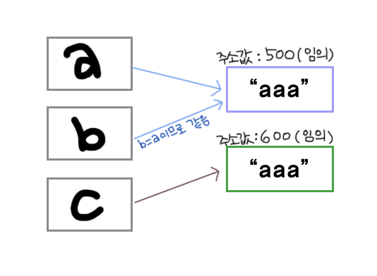

# Algorithm

## Prepare for Coding test <br/><br/>

# 목차

- #### [equals()와 ==의 차이점](#equals-----------)
<br/><br/>

---

## equals()와 ==의 차이점
- equals()는 대상의 내용 자체를 비교
- ==은 주소값을 비교


```java
System.out.println(a.equals(b)); //true
System.out.println(a==b); //true
System.out.println(a==c); //false
System.out.println(a.equals(c)); //true
```